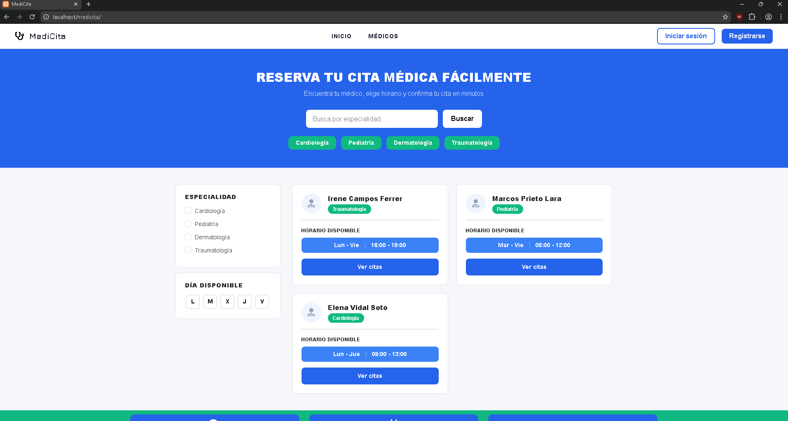
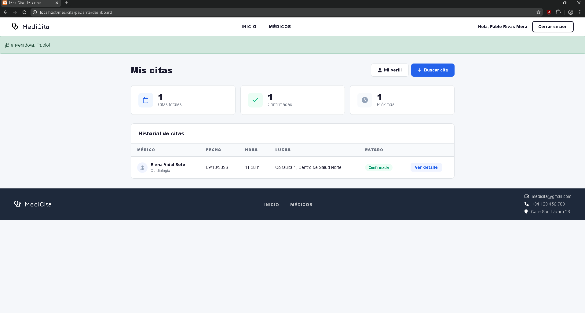
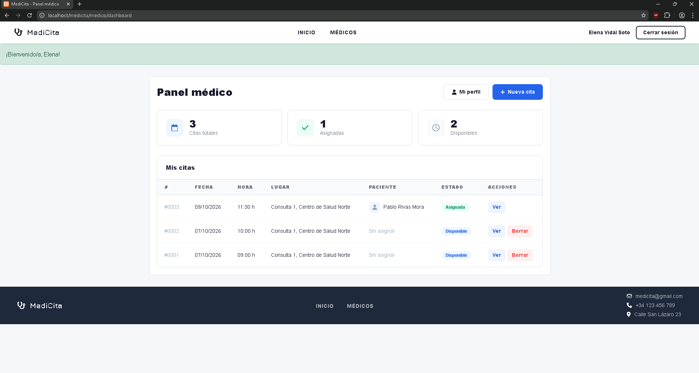

# MediCita

Web application for managing medical appointments, built with PHP (MVC pattern) and MariaDB/MySQL. Doctors publish available time slots and patients book them.

> Academic project (2nd year of Web Application Development, Jesuitas Logroño). All data in this repository is fictional.

## Features

- Registration and login for two roles: **patient** and **doctor**.
- Doctor dashboard: create and gestion medical appointments.
- Patient dashboard: see, reserve and consult medical appointments.
- Profile page where the patient can update their data and change their password.
- Appointments have two states: `disponible` and `asignada`.

## Tech stack

- PHP (own lightweight MVC: front controller, controllers, models, views)
- PDO with prepared statements
- MariaDB / MySQL
- HTML, CSS and JavaScript

## Security

- SQL injection prevention with PDO prepared statements.
- Passwords hashed with bcrypt (`password_hash` / `password_verify`).
- Automatic migration of legacy MD5 hashes to bcrypt on the user's next login.
- Session ID regenerated on login (session fixation) and session fully cleared on logout.
- Database credentials kept out of the repository (`config.php` is git-ignored).

Known limitation: there is no CSRF protection yet (planned improvement).

## Requirements

- XAMPP (Apache + MariaDB) or any PHP 8 + MySQL/MariaDB setup.

## Installation

1. Clone the repository inside the web root (for XAMPP, `htdocs`).
2. Import `database/citas_medicas.sql` using phpMyAdmin or the MySQL client. It creates the `citas_medicas` database and loads sample data.
3. Create a database user with permissions only on that database:
```sql
   CREATE USER 'medicita_app'@'localhost' IDENTIFIED BY 'choose_a_password';
   GRANT SELECT, INSERT, UPDATE, DELETE ON citas_medicas.* TO 'medicita_app'@'localhost';
```
4. Copy `config.example.php` to `config.php` and fill in your values (host, port, database, user, password, `BASE_URL`, `ROOT_PATH`).
5. Open the application in your browser (for example `http://localhost/medicita/`).

## Demo accounts

All sample accounts use the password `Demo1234!`. These are fictional accounts for testing only.

| Role    | Email                       |
|---------|-----------------------------|
| Doctor  | elena.vidal@example.com     |
| Doctor  | marcos.prieto@example.com   |
| Patient | pablo.rivas@example.com     |
| Patient | lucia.navas@example.com     |

## Screenshots





## Project structure

[VERIFICAR: pegar aquí el árbol real de carpetas]

## Possible improvements

- CSRF protection on forms.
- Automated tests.
- Appointment cancellation and reminders.